# Commands

### Cloning Meet the Octocat repository

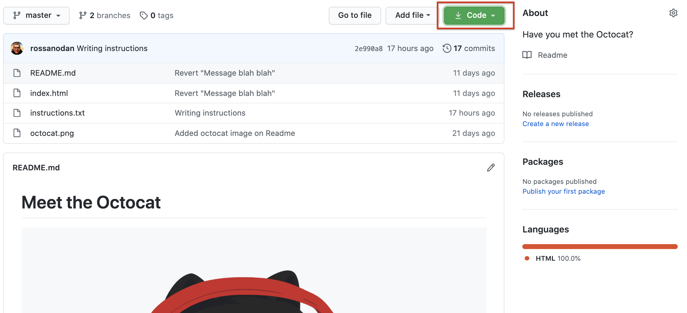
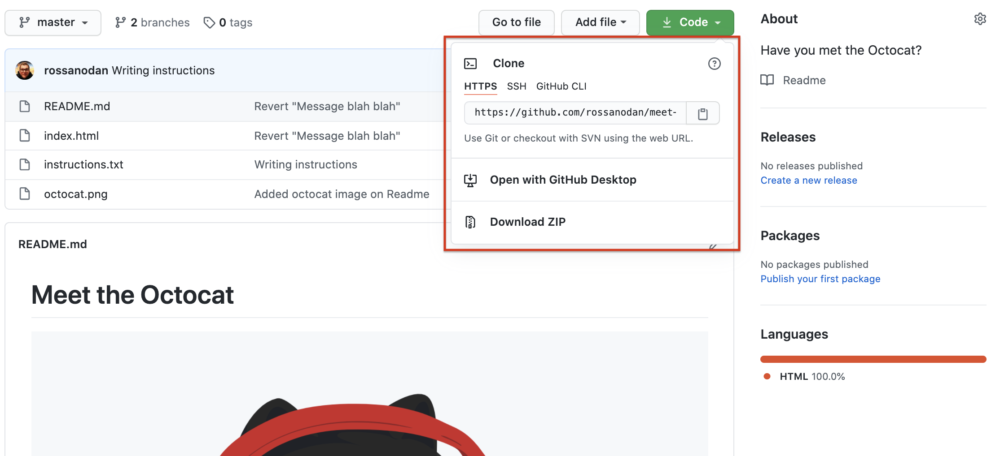

```
git clone https://github.com/rossanodan/meet-the-octocat.git
```

---

### Forking a repository

What does it mean?
Why we do fork?

---

### Creating a new branch

```
git checkout -b rossanodan-uda
```

or

```
git branch rossanodan-uda
git checkout rossanodan-uda
```

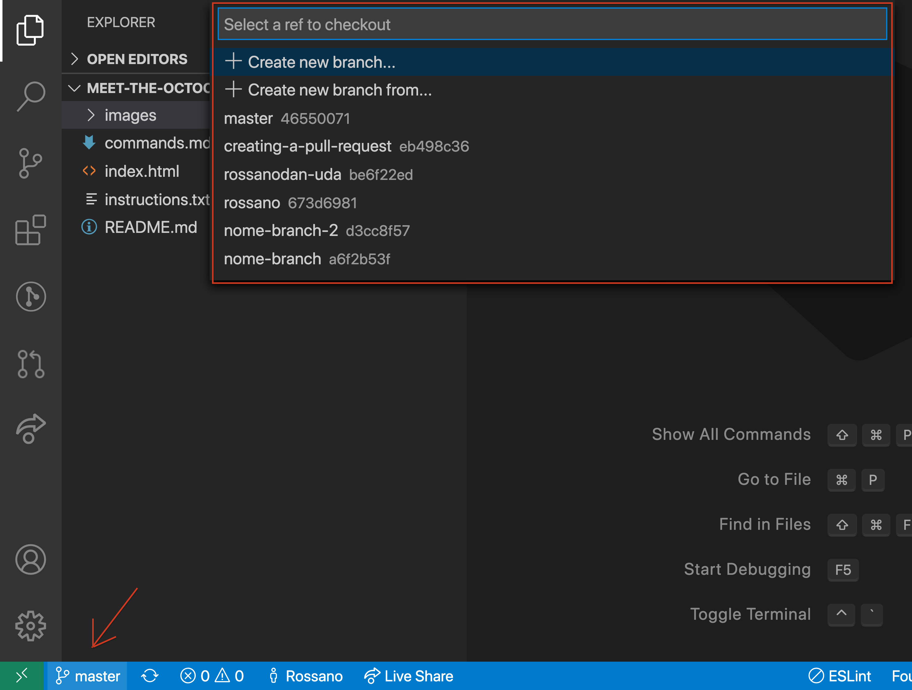

---

### Listing all branches

```
git branch
```

---

### Pushing changes

```
git add .
```

or

```
git add path/to/specific/file.txt
```

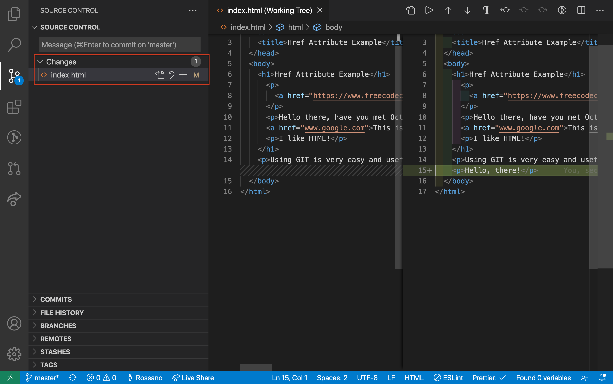


If you need to discard your changes

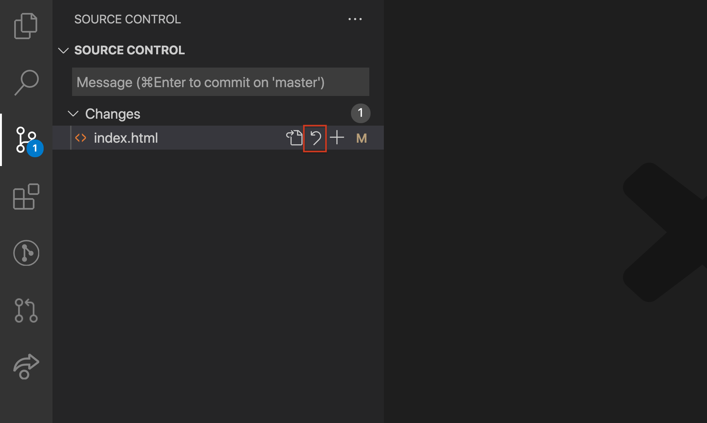

then

```
git commit -m "rossanodan-uda: hello, there"
```

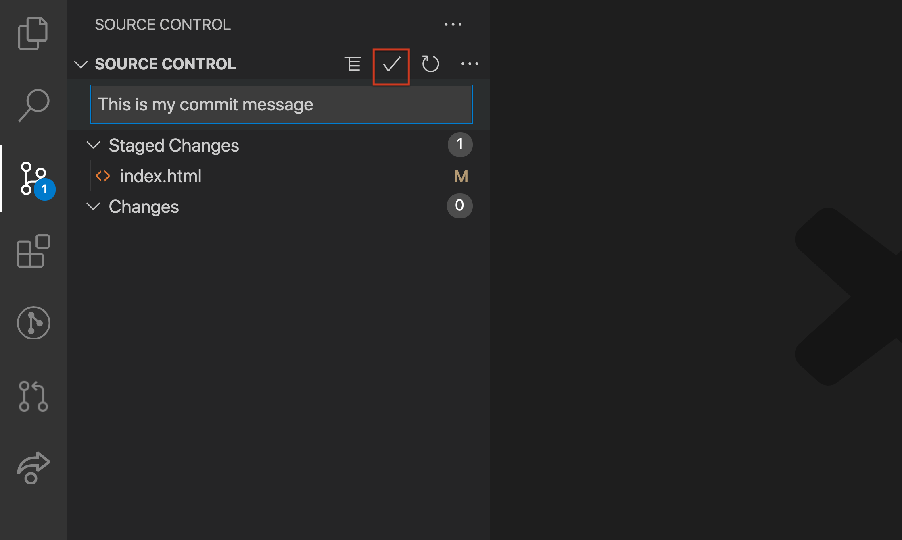

and finally

```
git push
```

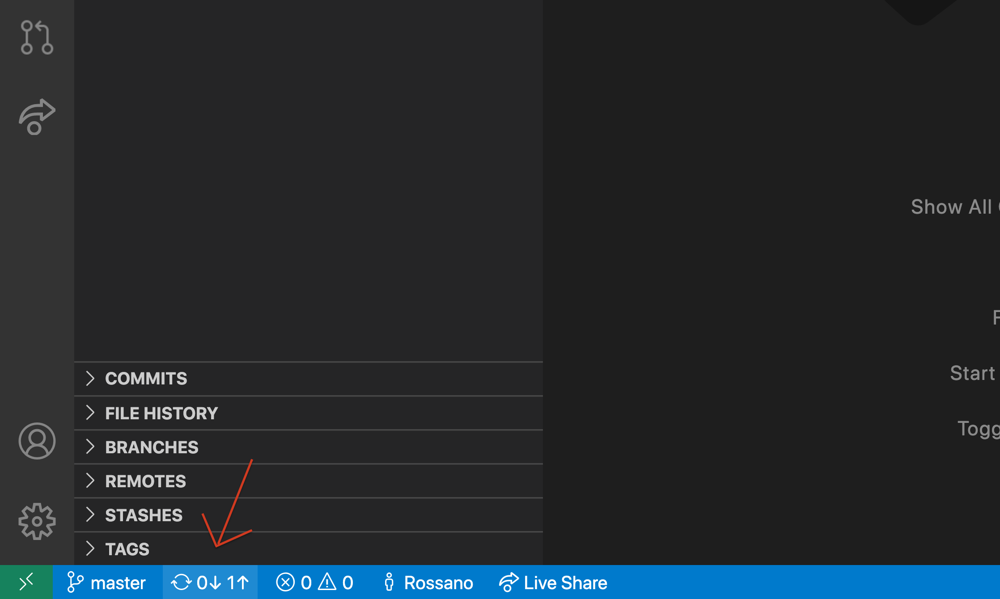

If you need to undo the last commit

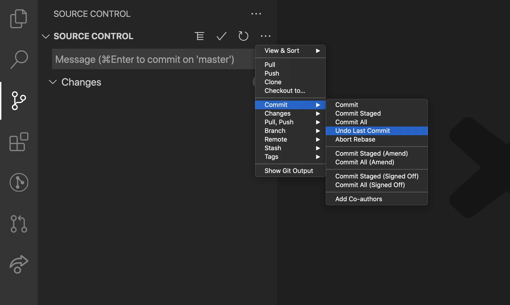

If this branch doesn't exist in the remote repository, GIT will ask you to create it with a specific command

```
git push --set-upstream origin rossanoda-uda
```

or

```
git push -u origin rossanodan-uda
```

---

### Creating a pull request

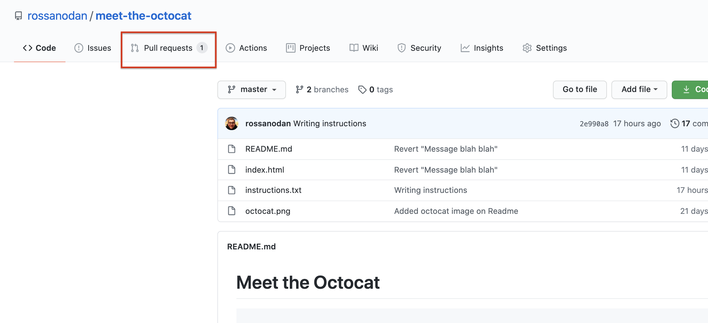
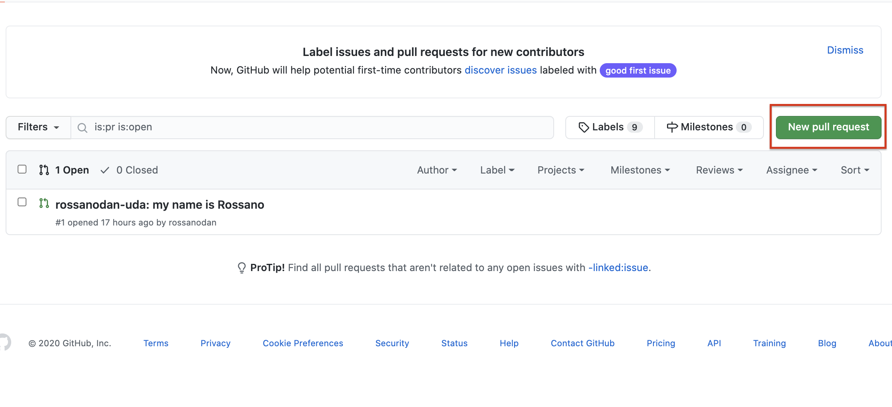
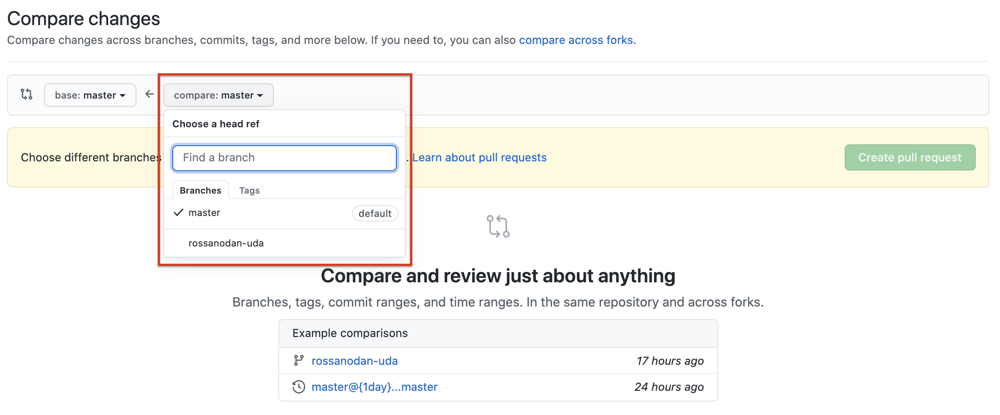
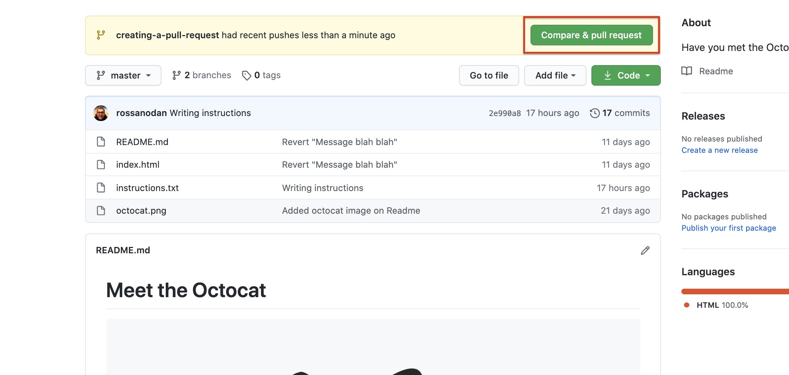

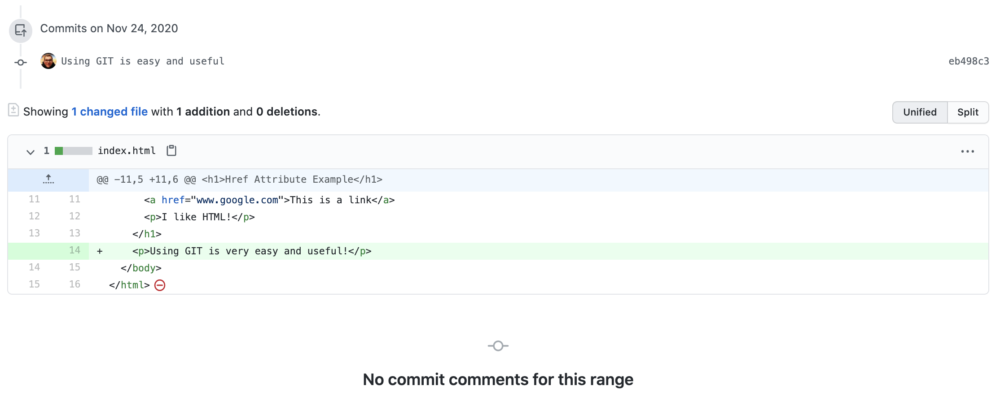

---

### Commenting a pull request for code review

Or simply for a discussion that may involve more people in the team!

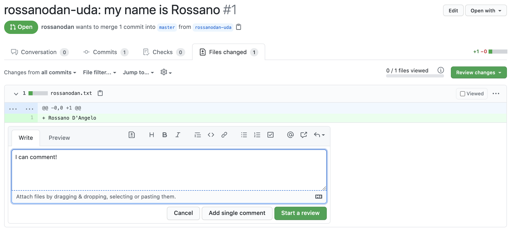
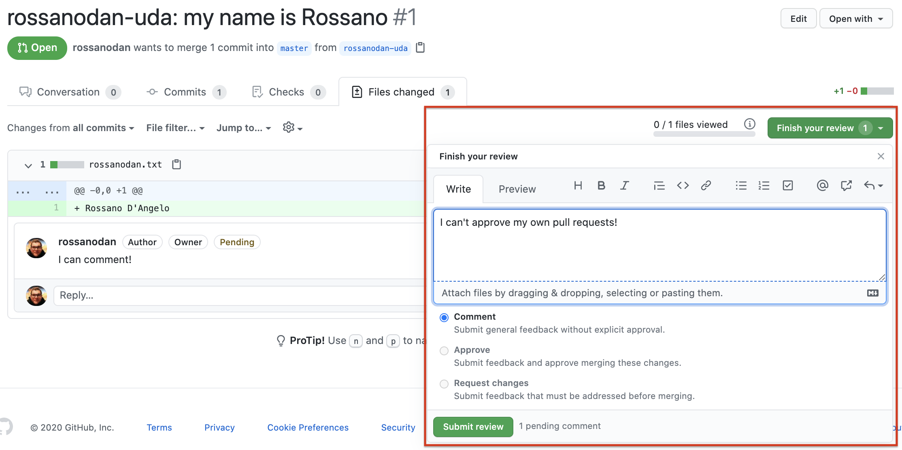

---

### Merging a pull request

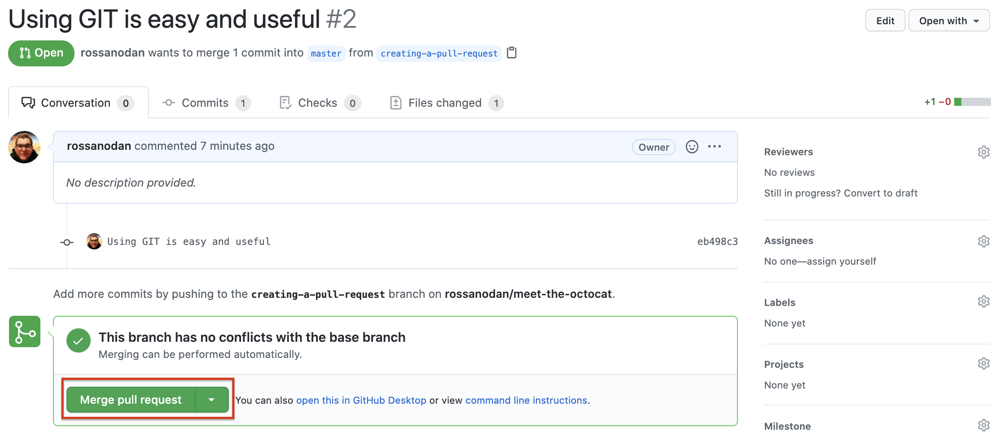

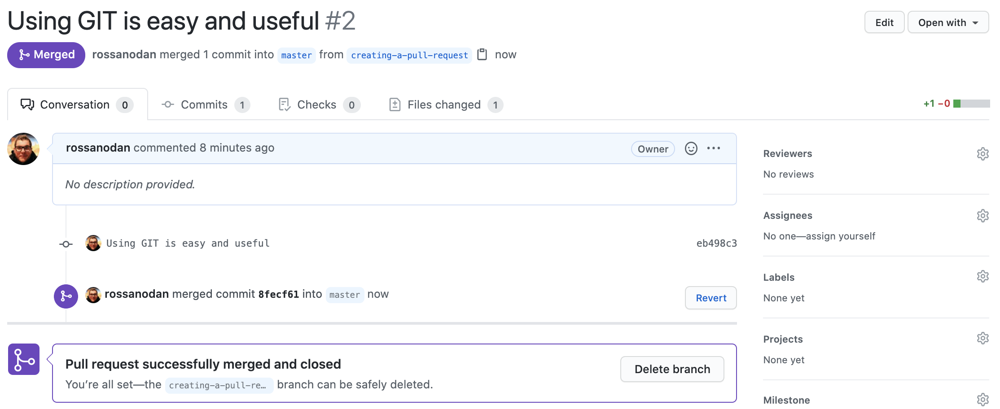

### GitHub extension for Visual Studio Code

Install the extension


and explore the list of things you can do directly from Visual Studio Code. You just need to authenticate with your GitHub credentials


